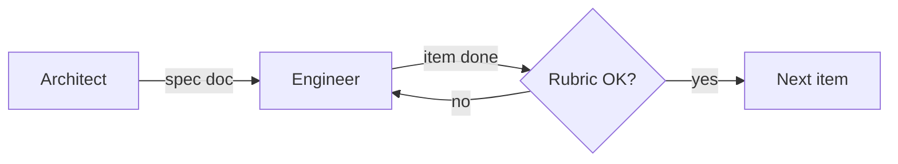

# Pulse — Agents & pipeline

Documentation hub for turning `figma-output/` into a production-ready app on the root scaffold.

## Language policy

**English only** for all agent output: code, comments, commit messages, specs, `DECISIONS.md`, docs, and user-facing tables. No mixed-language artifacts.

## Sources of truth

| Doc | Purpose |
|-----|---------|
| [README.md](README.md) | Assessment scope, stack, Parts 1–3, constraints |
| [RUBRIC.md](RUBRIC.md) | Scoring criteria (1–4) per dimension |
| [api-spec.md](api-spec.md) | API contract (MSW in `src/api/mock-server.ts` — **do not modify**) |
| [figma-output/](figma-output/) | Visual/structural reference; **not** the app to run or submit |
| [designs/](designs/) | Reference screenshots |
| `src/` | Target app: TanStack Router/Query, Tailwind v4, Biome |

## Pipeline



1. **Architect** — feasibility, architecture, spec in `docs/spec/`.
2. **Engineer** — **one** item (or subitem) per session, within spec limits, validated against `RUBRIC.md`.
3. Repeat until the spec is complete or README priorities are met.

Principle: **one task, one complete pass** — robust enough not to reopen the same item.

## Agents

| Agent | Skill | When to use |
|-------|-------|-------------|
| Architect | `@pulse-architect` | Kickoff, replanning, new epic, feasibility/structure questions |
| Engineer | `@pulse-engineer` | Implement a specified item/subitem |

Invocation: name the agent or skill in the prompt. E.g. *"As architect, spec Part 1 — layout shell"* or *"Engineer: run SPEC-003.2"*.

## Artifacts

| Path | Owner | Content |
|------|-------|---------|
| `docs/spec/SPEC-*.md` | Architect | Executable plan (skill template) |
| `docs/spec/STATUS.md` | Both | Index: item → status (`planned` / `in_progress` / `done` / `blocked`) |
| `DECISIONS.md` (root) | Engineer (Part 3) | Significant decisions for evaluation |

## Git workflow (semantic commits)

Evaluators review **history and behavior** change-by-change. Keep history succinct and semantic.

### Rules

- **One logical change per commit** — ideally one spec subitem; never mix unrelated work.
- **English** subject and body.
- **Conventional Commits** format: `<type>(<scope>): <subject>`
- Run `pnpm check` (and `pnpm build` when routes/types/build are touched) **before** committing.
- Do **not** commit unless the user asks; when asked, propose the message first if unclear.
- Do not rewrite published history (no force-push to the target branch).

### Types

| Type | Use for |
|------|---------|
| `feat` | User-visible capability (screen, filter, mutation) |
| `fix` | Bug or broken behavior |
| `refactor` | Structure/decomposition without behavior change |
| `style` | Visual-only (Tailwind, layout polish) |
| `docs` | Specs, `DECISIONS.md`, `AGENTS.md`, `STATUS.md` |
| `chore` | Tooling/config that is not product code |

### Scope (examples)

`layout`, `status-chip`, `feed`, `create-update`, `team-overview`, `my-updates`, `settings`, `api`, `routes`, `theme`, `spec`

### Subject line

- Imperative, ≤ 72 chars: `add status feed pagination`
- Tie to spec when applicable: body may include `SPEC-001 §2.1`

### Example sequence (illustrative)

```
docs(spec): add SPEC-001 foundation and status index
feat(theme): align design tokens with figma reference
feat(layout): add app shell with sidebar navigation
feat(status-chip): extract shared status badge component
feat(feed): add status feed route with list UI
feat(api): wire status list query and URL filters
```

Map each engineer session to **at most one** commit when the user requests a commit.

## Global constraints (non-negotiable)

- Fixed stack: React 18, TS, TanStack Router/Query, Tailwind v4, Vite, Biome, MSW, pnpm.
- Do not modify `src/api/mock-server.ts` or `public/mockServiceWorker.js`.
- No new state-management framework or CSS approach.
- `figma-output/` is input only; new/refactored code lives in `src/`.
- App commands: `pnpm dev`, `pnpm check`, `pnpm build` (repo root).
- Quality over full coverage; prioritize README Parts 1 and 2.

## Rubric dimensions (quick reference)

| Dimension | Weight | Focus |
|-----------|--------|-------|
| Component Architecture | 30% | Decomposition, props, reuse |
| Data Layer & API | 30% | Query keys, hooks, cache, URL state |
| Styling & UI Craft | 20% | Idiomatic Tailwind, responsive, states |
| Code Quality & TypeScript | 10% | Types, Biome, consistency |
| Communication & Judgment | 10% | `DECISIONS.md`, tradeoffs |

Threshold: average ≥ 3.0, no dimension &lt; 2.

## README → typical spec phases

| README | Typical spec topics |
|--------|---------------------|
| Part 1 | Tokens/theme, shell (`Layout`), shared primitives, screens (feed, form, overview, my updates, settings), Tailwind/TS cleanup |
| Part 2 | Domain types, Query hooks, file routes, endpoint integration, URL filters/pagination, loading/error, mutations/cache |
| Part 3 | Form validation, team overview empty state, responsive ~768px, `DECISIONS.md` |

## Cross-session handoff

- Architect updates `docs/spec/STATUS.md` when creating or replanning.
- Engineer marks `done` only after skill checklist + rubric for the scope.
- Blockers: record in `STATUS.md` with cause and dependency.

## Skills

- [.cursor/skills/pulse-architect/SKILL.md](.cursor/skills/pulse-architect/SKILL.md)
- [.cursor/skills/pulse-engineer/SKILL.md](.cursor/skills/pulse-engineer/SKILL.md)
