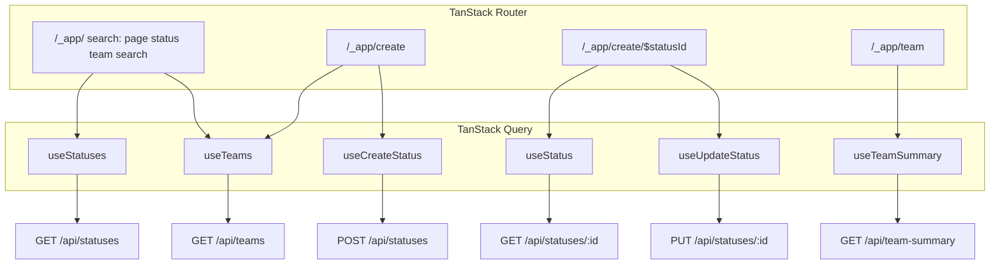

# SPEC-004: API integration (Part 2)

> Phase / README mapping: Part 2  
> Created: 2026-05-20  
> Depends on: [SPEC-003-screens.md](./SPEC-003-screens.md)

## Goal

Replace fixture-driven screens with MSW-backed TanStack Query hooks: paginated status feed with URL-synced filters, create/edit status mutations with cache invalidation, and live team overview metrics. Deliver visible loading and error UI (including MSW’s random 500s) without restructuring Part 1 components.

## Out of scope (epic)

- Edits to `src/api/mock-server.ts` or `figma-output/`
- My Updates API wiring (no endpoint — keep static [MyUpdatesScreen.tsx](../../src/components/screens/MyUpdatesScreen.tsx))
- Settings mutations or navigation
- `DELETE /api/statuses/:id`
- Optimistic updates (optional stretch; invalidation is required)
- Full client-side form validation, body min-length rules (Part 3)
- Team overview “no updates” empty state, figma `showEmpty` toggle (Part 3)
- Responsive sidebar collapse (~768px) (Part 3)
- `DECISIONS.md`
- Reintroducing `src/routes/index.tsx`

## Conventions (reference for all items)

- Target code: `src/` only; API contract: [api-spec.md](../../api-spec.md); stack per [AGENTS.md](../../AGENTS.md).
- **Fetch:** `src/lib/api-client.ts` — `apiGet`, `apiPost`, `apiPut`; parse JSON; throw typed `ApiError` (`status`, `error`, optional `details`).
- **Query keys:** `src/api/query-keys.ts` — factory pattern: `statusKeys.list(filters)`, `statusKeys.detail(id)`, `teamKeys.all`, `teamSummaryKeys.all`.
- **Hooks:** `src/api/hooks/*.ts` — one hook per query/mutation; screens consume hooks, not raw `fetch`.
- **Router + Query:** Feed uses `validateSearch`; edit route uses `$statusId` param + `loader` with `queryClient.ensureQueryData` (required on edit route).
- **Types:** Reuse [status-update.ts](../../src/types/status-update.ts), [team.ts](../../src/types/team.ts); add `PaginatedStatusesResponse` and related types in `src/types/api.ts`.
- **Feed page size:** `limit=6` on `GET /api/statuses` (matches current [StatusFeedScreen](../../src/components/screens/StatusFeedScreen.tsx) UX).
- **Projects:** No `/api/projects` — create/edit keep [fixtureProjects](../../src/fixtures/projects.ts) for the project dropdown (MSW accepts any string).
- **Edit route:** `/create/$statusId` via `src/routes/_app/create.$statusId.tsx` (dedicated param route).
- Suggested commits: Conventional Commits per AGENTS.md.

### Data flow (reference)



---

## 4.1 API client and query conventions

**Status:** `planned`  
**Depends on:** SPEC-003  
**README:** Part 2  
**Figma reference:** —  
**Targets:** `src/lib/api-client.ts`, `src/types/api.ts`, `src/api/query-keys.ts`

### Boundaries

- Do **not** wire screens or routes in this item.
- Do **not** edit `mock-server.ts` or add dependencies (no Zod unless already in `package.json`).
- Forbidden: `figma-output/`

### Responsibilities

- `api-client.ts`: base path `/api`; helpers throw `ApiError` on non-OK responses with parsed body when JSON.
- `src/types/api.ts`:
  - `PaginatedStatusesResponse` — `{ data: StatusUpdate[]; pagination: { page, limit, total, totalPages } }`
  - `ApiError` type aligned with [api-spec.md](../../api-spec.md) error shape
  - Request payload types for create/update where useful
- `query-keys.ts`:
  - `statusKeys.all`, `statusKeys.lists()`, `statusKeys.list(filters)` — `filters` includes `page`, `limit`, `status`, `team`, `search` (use `undefined` or sentinel for omitted API params consistently)
  - `statusKeys.details()`, `statusKeys.detail(id)`
  - `teamKeys.all`
  - `teamSummaryKeys.all`

### Definition of done

- [ ] Client and types compile; keys are stable and documented in code
- [ ] No screen imports fixtures for API paths introduced here
- [ ] `pnpm check` passes

### Target rubric

| Dimension | Minimum |
|-----------|---------|
| Data Layer & API | 3 |
| Code Quality & TypeScript | 3 |
| Component Architecture | N/A |
| Styling & UI Craft | N/A |
| Communication & Judgment | N/A |

### Suggested commit

`feat(api): add api client and query key factories`

---

## 4.2 Teams query and shared async feedback UI

**Status:** `planned`  
**Depends on:** 4.1  
**README:** Part 2  
**Figma reference:** —  
**Targets:** `src/api/hooks/use-teams.ts`, `src/components/feedback/QueryState.tsx` (or `AsyncState.tsx`)

### Boundaries

- Do **not** wire status feed pagination or `useStatuses` yet.
- `FeedToolbar` stays a controlled presentational component (no internal fetching).
- Forbidden: `mock-server.ts`

### Responsibilities

- `useTeams()` — `useQuery` with `teamKeys.all`, `queryFn` → `GET /api/teams`, returns `Team[]`.
- `QueryState` (name may vary): props for `isPending`, `isError`, `error`, `refetch`, `children`; render loading UI, error message + **Retry** button calling `refetch`, else `children`.
- Use semantic tokens for error/loading surfaces (no ad hoc hex).
- Integrate `QueryState` at least once (e.g. temporary usage in feed toolbar area, or document usage starting in 4.3 — prefer wiring teams into feed toolbar parent in 4.3 if 4.2 is thin).

### Definition of done

- [ ] `useTeams` fetches live teams in dev (MSW)
- [ ] Shared async UI component exists and is reusable
- [ ] `pnpm check` passes

### Target rubric

| Dimension | Minimum |
|-----------|---------|
| Data Layer & API | 3 |
| Component Architecture | 3 |
| Code Quality & TypeScript | 3 |
| Styling & UI Craft | 3 |

### Suggested commit

`feat(api): add teams query and async state UI`

---

## 4.3 Status feed — URL search + paginated query

**Status:** `planned`  
**Depends on:** 4.1, 4.2  
**README:** Part 2  
**Figma reference:** `figma-output/src/app/components/StatusFeed.tsx`  
**Targets:** `src/api/hooks/use-statuses.ts`, `src/routes/_app/index.tsx`, `src/components/screens/StatusFeedScreen.tsx`

### Boundaries

- No mutations; edit links on cards are optional here (required in 4.4).
- Do **not** client-slice fixture data; server pagination only.
- Forbidden: `mock-server.ts`, changing `StatusUpdateCard` props contract

### Responsibilities

- `useStatuses(filters)` — `GET /api/statuses` with query string built from filters; `limit=6`; omit `status`/`team` when value is `'all'`; pass `search` when non-empty.
- Route `/_app/` `validateSearch` (coerce types safely):

```typescript
// Search shape after validation
{
  page: number      // default 1
  status: string   // default 'all'
  team: string     // default 'all'
  search: string   // default ''
}
```

- `StatusFeedScreen`: read search from route (`Route.useSearch()` or props from route wrapper); drive `FeedToolbar` / `FeedPagination`; update URL via `navigate({ search })`; reset `page` to `1` when `status`, `team`, or `search` changes.
- Optional: 300ms debounce before writing `search` to URL (recommended in handoff; not required for DoD).
- Remove imports from `src/fixtures/status-updates.ts` and local `useMemo` filter/slice logic.
- Wrap list in `QueryState`: loading skeleton/spinner in list area; empty `data` → empty list (not error); error banner + retry.
- `useTeams()` for toolbar team options (replace `fixtureTeams`).
- Keep `StatusUpdateCard` unchanged.

### Definition of done

- [ ] `/` reflects filters and page in URL (`?page=&status=&team=&search=`)
- [ ] Pagination uses API `pagination.totalPages` / `total`
- [ ] Loading and error states visible; retry works after simulated 500
- [ ] `pnpm check` passes
- [ ] `pnpm build` passes

### Target rubric

| Dimension | Minimum |
|-----------|---------|
| Data Layer & API | 3 |
| Component Architecture | 3 |
| Styling & UI Craft | 3 |
| Code Quality & TypeScript | 3 |

### Suggested commit

`feat(feed): wire status list to api with url filters`

---

## 4.4 Create and edit status — mutations and cache

**Status:** `planned`  
**Depends on:** 4.1, 4.2  
**README:** Part 2  
**Figma reference:** `figma-output/src/app/components/CreateUpdate.tsx`  
**Targets:** `src/api/hooks/use-status.ts`, `src/api/hooks/use-create-status.ts`, `src/api/hooks/use-update-status.ts`, `src/components/screens/CreateUpdateScreen.tsx`, `src/routes/_app/create.tsx`, `src/routes/_app/create.$statusId.tsx`, `src/components/feed/StatusUpdateCard.tsx`

### Boundaries

- No `DELETE`; no My Updates list wiring.
- Do **not** align `fixtureProjects` names with MSW seed projects (optional note only).
- Optimistic updates are out of scope; **invalidateQueries** on success is required.
- Part 3 body min-length client validation is out of scope; keep existing project-required check; must surface API `details` on 400.
- Forbidden: `mock-server.ts`

### Responsibilities

- **Create** (`/create`):
  - `useCreateStatus` — `POST /api/statuses` with `{ teamId, project, status, body, blockers, statusDate }`.
  - Add required **Team** `<Select>` populated from `useTeams()`.
  - Map form field `updateBody` → API `body`; `blockers` empty string → `null` if appropriate.
  - Submit: pending on primary button, disable inputs; success → `invalidateQueries` on `statusKeys.lists()` and `teamSummaryKeys.all`, navigate to `/`.
  - Errors: map `details` to fields where keys match; generic message + retry for 500/network.
- **Edit** (`/create/$statusId`):
  - New route file `create.$statusId.tsx`; `loader` calls `queryClient.ensureQueryData` for `statusKeys.detail(statusId)`.
  - `useStatus(statusId)` hydrates form; heading “Edit Status Update”.
  - `useUpdateStatus` — `PUT /api/statuses/:id` with changed fields; same invalidation as create.
  - Reuse `CreateUpdateScreen` with mode prop or parallel thin wrappers — engineer’s choice; routes stay thin.
- **Edit entry:** `StatusUpdateCard` — accessible `Link` to `/create/$statusId` (e.g. “Edit”).
- Remove fake submit that only navigates home without API call.

### Definition of done

- [ ] Create submits to MSW; new item appears on feed after redirect without hard refresh
- [ ] Edit loads existing status, saves via PUT, feed reflects changes
- [ ] Cache invalidation runs on successful create/update
- [ ] Team field present and required for create
- [ ] `pnpm check` passes
- [ ] `pnpm build` passes

### Target rubric

| Dimension | Minimum |
|-----------|---------|
| Data Layer & API | 3 |
| Component Architecture | 3 |
| Code Quality & TypeScript | 3 |
| Styling & UI Craft | 3 |

### Suggested commit

`feat(create-update): add create and edit mutations with cache invalidation`

---

## 4.5 Team overview — summary query

**Status:** `planned`  
**Depends on:** 4.1, 4.2  
**README:** Part 2  
**Figma reference:** `figma-output/src/app/components/TeamOverview.tsx`  
**Targets:** `src/api/hooks/use-team-summary.ts`, `src/components/screens/TeamOverviewScreen.tsx`, `src/routes/_app/team.tsx`

### Boundaries

- Do **not** implement empty state when summary has no meaningful data (Part 3).
- Do **not** add status mutations on this screen.
- Forbidden: `mock-server.ts`, `fixtureTeamSummary` usage in screen after completion

### Responsibilities

- `useTeamSummary()` — `GET /api/team-summary`, returns `TeamSummary`.
- `TeamOverviewScreen`: replace `fixtureTeamSummary` with hook + `QueryState` for metrics grid and member table.
- Preserve layout, `MetricCard`, `StatusChip`, and CTA link to `/create` when data is present.
- Loading/error with retry consistent with 4.2.

### Definition of done

- [ ] `/team` shows live metrics and members from MSW
- [ ] Loading and error states with retry
- [ ] No fixture import for team summary in screen
- [ ] `pnpm check` passes
- [ ] `pnpm build` passes

### Target rubric

| Dimension | Minimum |
|-----------|---------|
| Data Layer & API | 3 |
| Component Architecture | 3 |
| Styling & UI Craft | 3 |
| Code Quality & TypeScript | 3 |

### Suggested commit

`feat(team-overview): wire team summary to api`

---

## Part 2 vs Part 3 boundary

| Concern | SPEC-004 (Part 2) | Part 3 |
|---------|-------------------|--------|
| Form validation | API `details` + existing project required | Body min length, fuller client rules |
| Team empty state | Loading/error only | Real empty when summary has no data |
| Feed search debounce | Optional (300ms before URL write recommended) | — |
| Cache strategy | `invalidateQueries` after mutations (note rationale for DECISIONS) | — |
| My Updates / Settings | Static UI | — |

---

## Handoff notes

- **Engineer order:** 4.1 → 4.2 → 4.3 → 4.4 → 4.5 (4.2 may merge with 4.1 in one session if small).
- **Routes already exist** under `_app/` from SPEC-001; Part 2 adds search validation on index, new `create.$statusId`, and data hooks — not a greenfield route tree.
- **Risk:** `fixtureProjects` names differ from MSW seed `projects` array — acceptable; API accepts any project string.
- **Risk:** MSW POST assigns a random author — expected; no `authorId` filter for My Updates until a future spec/API.
- **Cache:** Prefer invalidation over optimistic updates for rubric clarity; document choice in Part 3 `DECISIONS.md`.
- **Next epic:** Part 3 polish spec (validation, team empty state, ~768px responsive, `DECISIONS.md`).
